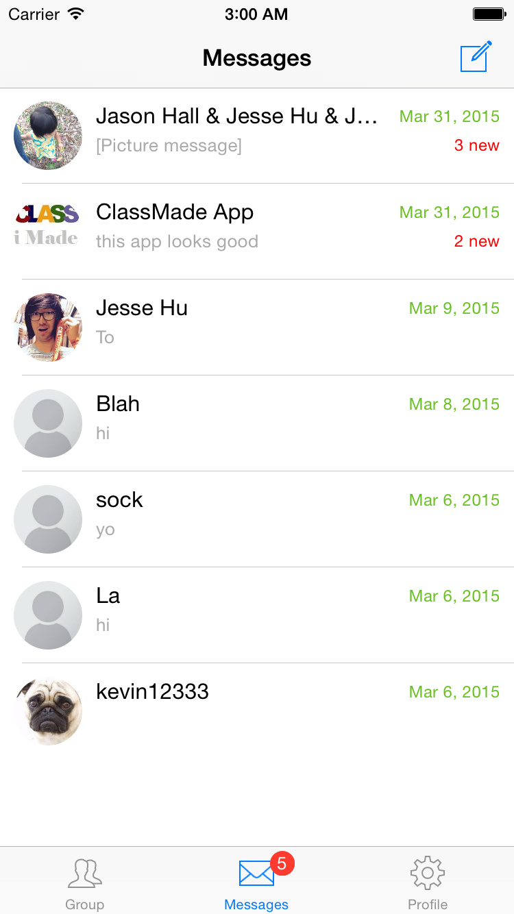

# SwiftParseChat
An Example iOS Chat Application with Parse, written in Swift

## Screenshots

## Overview
This is a re-write of https://github.com/relatedcode/NotificationChat using Swift and Storyboards. Supports Facebook login.
Uses Alamofire for Swift HTTP requests, and APAddressBook for easier address book contacts. Please Star this repo if you find it useful.

## Installation
- Clone the repository: https://github.com/huyouare/SwiftParseChat.git
- Open the cloned SwiftParseChat repo folder in console
- Run `pod install`
- Open SwiftParseChat.xcworkspace in XCode
